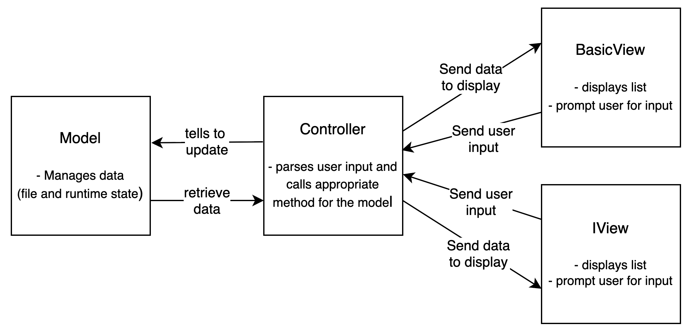

# CLI Todo

A persistent, hierarchical command-line To-Do application allowing infinite subtasks, built with a flexible architecture to support both rich (Ncurses) and standard text interfaces. See documentation [here](https://bmendbayar.github.io/cli-todo/).

## Demo


## Architectural Design

I chose Model-View-Controller (MVC) to decouple data management from the user interface, which allows for swapping between a basic text UI and a rich terminal UI without changing core logic.

* Model: Manages the recursive Task data structure and handles JSON file I/O using Boost.JSON.
* View: An abstract base class defining the interface.
  * ViView (Default): Ncurses-based with Vi-like motions.
  * BasicView: Standard text-based I/O.
  * IView: Ncurses-based TUI for an interactive experience.
* Controller: Connects the two, parsing user input strings (like paths "121") into model commands.



## Key Features

* Hierarchical Tasks: Task structs contain a vector of children, enabling infinite nesting.
* Persistence: Auto-saves/loads to .todo/todo_list.json to prevent data loss.
* Multi-Interface: Run with -b for basic mode or -i for a slightly more interactive moe or default to the Vi-like windowed interface.

## Roadmap

- [X] Task inheritance
- [X] Task priority
- [X] Vi view
- [X] Undo/redo
- [ ] Due dates
- [ ] Change task description

## Installation

Clone the repository and install dependencies:
### Dependencies
* ncurses
* boost
* cmake
* C compiler

```bash
git clone https://github.com/bmendbayar/cli-todo.git
cd cli-todo
mkdir build
cd build
cmake ..
make

# add to path
cp todo ~/.local/bin
```

## License

This project is licensed under the MIT License - see the [LICENSE](LICENSE) file for details.
